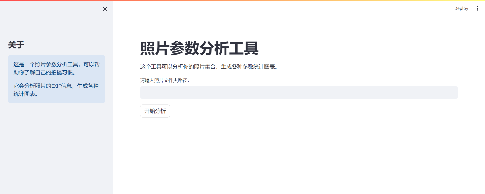
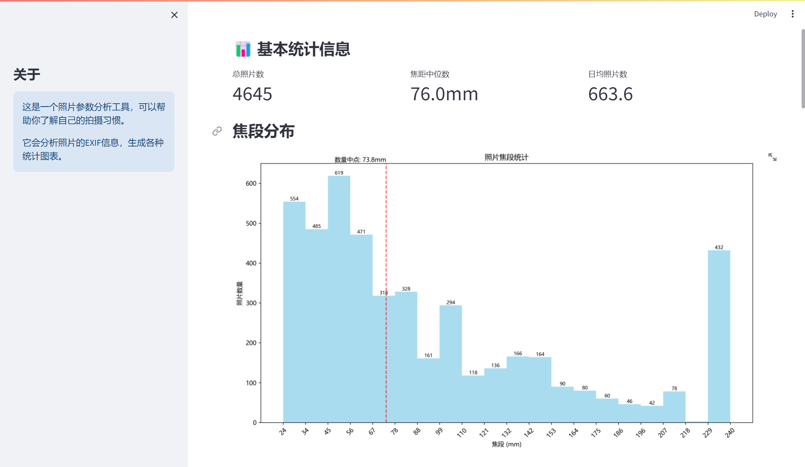
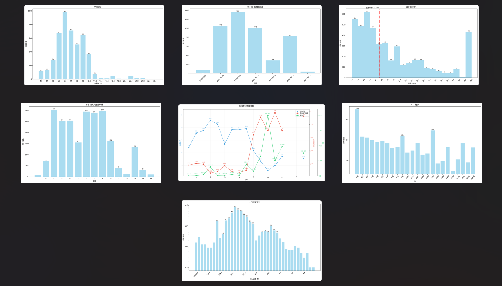

# 照片参数分析工具

一个用于分析照片参数的Python工具，能够读取照片的EXIF信息并生成多维度的统计图表，帮助摄影师分析自己的拍摄习惯。

## 功能特点

- **多格式支持**：支持分析多种照片格式，包括JPG、JPEG、PNG、BMP、TIFF。
- **双界面交互**：提供命令行和网页两种交互界面，满足不同用户的需求。
- **全面的统计图表**：生成以下统计图表，帮助你全面了解拍摄习惯：
  - **焦段分布统计**：了解常用焦段范围。
  - **每日照片数量统计**：分析拍摄频率。
  - **每小时照片数量统计**：发现一天中的拍摄高峰时段。
  - **ISO分布统计**：查看常用ISO设置。
  - **光圈统计**：分析常用光圈范围。
  - **快门速度统计**：了解拍摄时的快门速度偏好。
  - **每小时拍摄参数变化**：观察不同时间段的拍摄参数变化。







## 快速开始

项目提供PyInstaller编译后的二进制文件，方便用户直接使用。以下是可用版本：

- **命令行界面版本（ImageAnalyse-CLI）**：提供更高效的分析，适合熟悉命令行操作的用户。

## 输出结果

- **图表保存路径**：所有统计图表将保存在程序目录下的`output`文件夹中。
- **统计信息**：包括以下内容：
  - 总照片数
  - 日均照片数
  - 各项参数的分布图表

## 从源码运行

### 安装依赖

在运行之前，请确保已安装以下Python包

```bash
pip install pillow matplotlib numpy tqdm streamlit
```

### 启动方式

- **命令行界面**：

```bash
python main.py
```

- **网页界面**：

```bash
streamlit run app.py
```

## 注意事项

- **EXIF信息完整性**：本工具依赖照片的EXIF信息进行分析，请确保照片文件包含完整的EXIF信息。
- **分析时间**：对于包含大量照片的文件夹，分析过程可能需要一些时间，请耐心等待。
- **使用原始照片**：建议使用未经编辑的原始照片进行分析，因为经过编辑的照片可能会丢失部分EXIF信息。